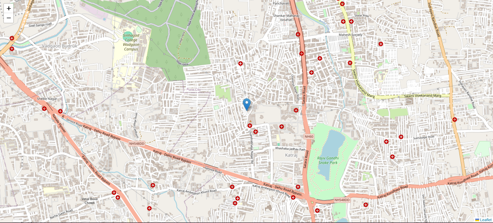
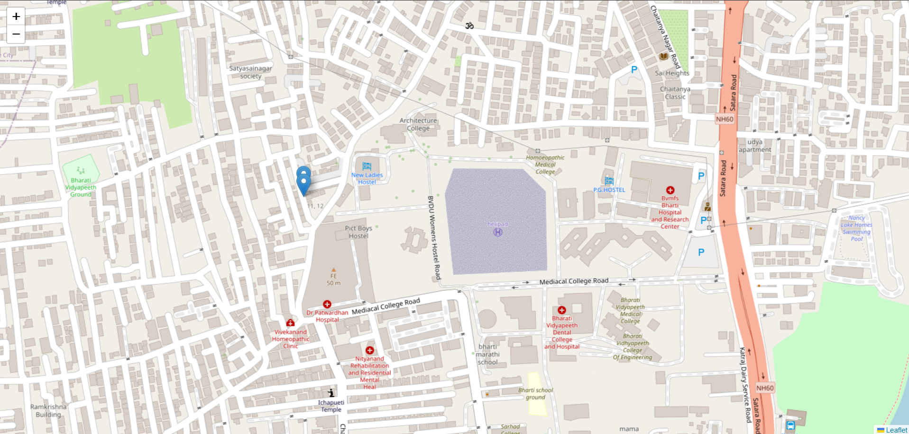

# **Map-Track**

Developed a real-time location tracking system built using Node.js, Express, Socket.io, and Leaflet.js. It allows you to track the movement of devices on a live map, displaying their locations in real-time. The system leverages the browser's Geolocation API, OpenStreetMap tiles for global map visualization, and dynamic marker updates for seamless user experience.

---

## **Features**

- **Real-Time Location Tracking:** Utilizes the browser's Geolocation API to fetch and track the live location of devices.
- **Interactive Map:** Integrates Leaflet.js to display device markers on a live map.
- **Real-Time Communication:** Powered by Socket.io for seamless and efficient real-time updates between the server and clients.
- **Automatic Marker Updates:** Markers are automatically updated on the map when a user's location changes.
- **User Disconnection Handling:** Markers are removed from the map when a user disconnects.

---

## **Tech Stack**

- **Backend:** Node.js, Express.js.
- **Real-Time Communication:** Socket.io.
- **Frontend Map Integration:** Leaflet.js.

---

## **Installation and Setup**

**1. Clone the Repository**

```bash
git clone https://github.com/rushikesh5035/map-track.git
```

**2. Install dependencies:**

```bash
npm install
```

**3. Start the server:**

```bash
node app.js
```

**4. Access the application:**
Open your browser and navigate to http://localhost:3000.

---

## **Usage**

1. Open the application in multiple browsers or devices.
2. Allow location access when prompted by the browser.
3. Observe the real-time movement of markers on the map.
4. Disconnect a device to see its marker removed from the map.

## **Screenshots**




